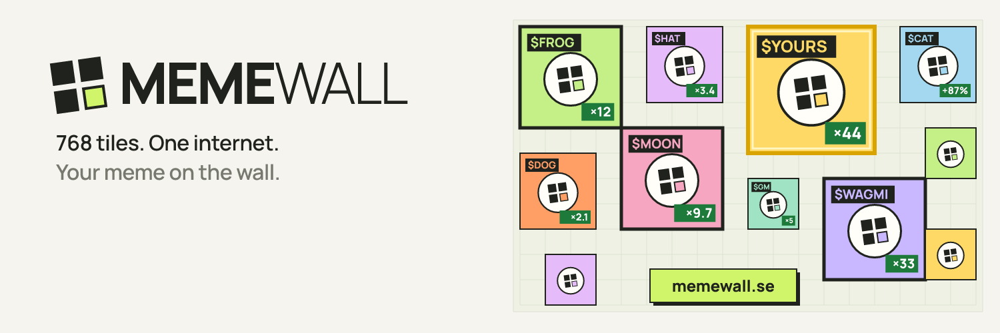

### The memecoin billboard. 768 tiles, and every memecoin wants one.

 

**MEMEWALL** is a live billboard for the memecoin internet. One wall of 32 × 24 tiles that everyone sees at once. Paste a token, claim a square, and your meme hangs there — until your time runs out or someone pays double to take the spot.

## 🔥 On the wall right now

Live from the wall: coins that did 2x+ in the last 24 hours and the top mover of every chain — Solana, Robinhood Chain, Base, BNB Chain, Ethereum. Refreshed every 6 hours.

## 🧱 How it plays

| | |
|---|---|
| 🟩 **Claim** | A free tile is **$5 for 6 hours**. Neighbouring tiles of one token merge into one big poster. |
| ⏳ **Extend** | Keep your spot: **+6 hours for $5** a tile, any time, up to 7 days ahead. |
| ⚔️ **Take over** | Take someone's tile before their time is up for **double** what they paid — $10, $20, $40… They get their money back; you get a fresh 6 hours. |
| 🏴‍☠️ **Raid** | Communities chip in together to take a spot none of them could alone. |
| 👑 **King of the day** | The token holding the most wall today wears the crown tomorrow. |
| 🏁 **Seasons** | Every month the players who held the wall longest take the season. |
| 🎁 **First square free** | The first 30 coins get a 2×2 for 6 hours for one post on X about it. |
| 🤝 **Invite & earn** | 10% of what the wall makes from every friend you bring, for 30 days. [How it works ↓](#-invite--earn) |

## 🤝 Invite & earn

Bring people to the wall and earn real money from what they play. Your link is on [memewall.se](https://memewall.se) under **Earn 10%** in the header, or in **My tiles**, once your wallet is connected.

| | |
|---|---|
| 💸 **10% for 30 days** | For 30 days after a friend first signs in with your link, you get **10% of what the wall makes from them**: $5 for new tiles, the wall's half of every takeover, premium and auction bids. |
| ⚡ **Paid at once** | Earnings land on your MEMEWALL balance the moment your friend pays. Withdraw any time from $10, like any other balance. |
| ⏳ **Your friends win too** | A friend who joins with your link gets **+6 hours on their first tiles** — 12 hours on the wall instead of 6. |
| 🏆 **Referrer of the week** | Monday to Monday (UTC), whoever brings the most friends who pay for the first time wins a **free 2×2 for 6 hours**. Paying friends count, empty sign-ups don't. |
| 📣 **Every share carries your link** | Sharing a poster, a raid or your free-square post on X adds your referral link automatically. |

What a takeover pays back to the previous owner is their money, not the wall's, so it isn't counted. A link only counts on a wallet's very first sign-in, one referrer per wallet, and inviting yourself from the same network doesn't count.

## 🔐 Safe to connect your wallet

MEMEWALL is built so that connecting a wallet never gives anyone the power to take from it. Here is exactly what the site asks your wallet for — and what it never will.

**✍️ Signing in is a text message, not a transaction**
- You sign a short plain-text message that your wallet shows in full: `MEME WALL wallet verification`, your network, your address, a random nonce and an expiry time.
- A text signature **cannot move tokens, grant approvals or sign transactions**. It is valid for 5 minutes and works exactly once.

**🚫 What MEMEWALL never asks for**
- **No `approve`, no `permit`, no `setApprovalForAll`, no blind or typed-data signatures.** Nothing ever gets permission to spend from your wallet.
- **Never your seed phrase or private key.** Not on the site, not in DMs, not "for support". Anyone who asks is not us.

**💸 Topping up is one ordinary transfer you confirm yourself**
- A top-up is a single transfer for the exact amount shown. Your wallet shows the amount and the recipient before you press confirm.
- Only **USDC on Solana**, **USDT on Ethereum** and **BNB Chain** (at $1 a coin), and **ETH on Ethereum** and **Robinhood Chain** (at the market price when you top up). Tokens are recognised by their official contract / mint addresses — never by ticker, so fake "USDT" tokens don't count.
- Top-ups only ever go to these addresses — check them in the wallet window:
  - EVM (Ethereum, BNB Chain, Robinhood Chain): `0x42E1A40594f95a5Aaa200CF728c1f4eD56d47058`
  - Solana: `GpVGZuBN4y5p7Jmu183twXietU5NSP1RHyg5mp4PvPoF`
- On Solana the same transfer may create the treasury's USDC account the first time — a one-off network fee of about 0.002 SOL, shown by your wallet.

**🧾 How the money is handled**
- **The blockchain is the only proof of payment.** The server itself checks every top-up on chain: it must come from your signed-in wallet, in the right token, for the right amount, with enough confirmations. One transaction counts once — it can never be reused.
- **The treasury's keys never touch the server.** Withdrawals go out from a separate payout wallet that holds only a small float, and every payout needs a one-time code from the operator's authenticator app. They are sent only to the wallet you signed in with — never to another address. Minimum $10, within 24 hours.
- **Emergency stop:** payments can be paused in seconds while the wall keeps running.
- Your balance on MEMEWALL is held by the project until you withdraw it. Keep on the wall what you play with.

**🛡️ The site itself**
- **Only its own code runs.** A strict Content Security Policy blocks third-party scripts, and there are no ad or tracking scripts at all.
- **No tracking cookies.** Visits are counted with an anonymous daily hash; the only cookie is your session — `HttpOnly`, so page scripts can't read it, and only its hash is stored on the server.
- **One domain: [memewall.se](https://memewall.se).** Official accounts: [@memewallse](https://x.com/memewallse) on X and [@memewallbot](https://t.me/memewallbot) in Telegram. We never DM first.

<b>✅ 20-second self-check before you connect</b>

 

1. The address bar says **memewall.se**.
2. Signing in opens a **text message** to sign — not a transaction, not an approval.
3. A top-up opens a **token transfer** for the amount you typed, to one of the two addresses above.
4. Nothing ever asks you to **approve** spending or to enter a **seed phrase**.

If anything looks different, stop and tell us on X.

Found a vulnerability? Message [@memewallse](https://x.com/memewallse) — we answer security reports first.

## ✈️ In Telegram

[@memewallbot](https://t.me/memewallbot) pings you when your tiles are taken over, your time is about to run out or a raid closes — and `/wall $TICKER` in any group shows where a coin stands on the wall.

 

A poster is an ad, not an endorsement. Anyone can put any token on the wall — always DYOR.

